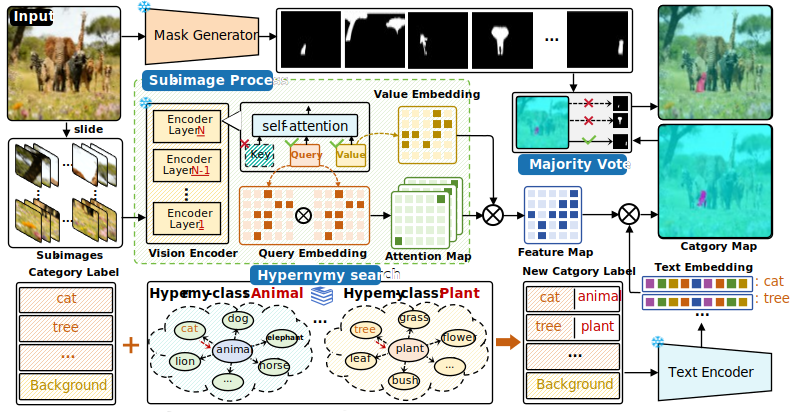
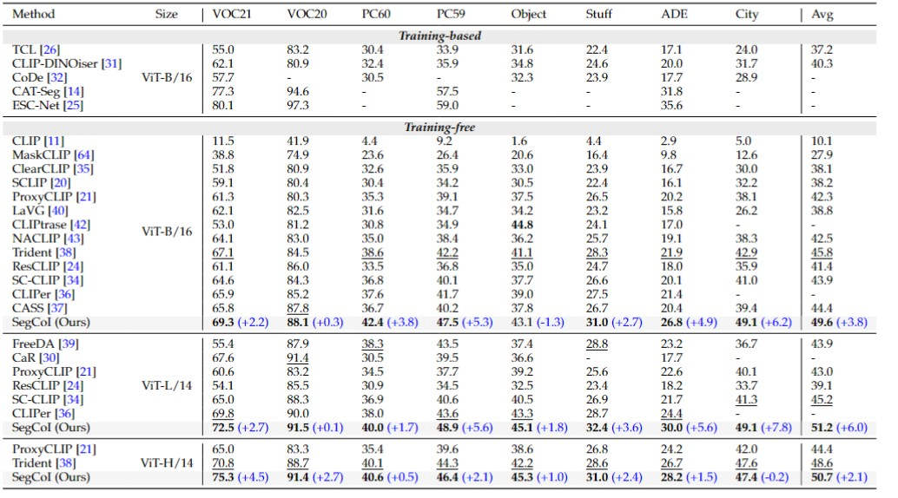
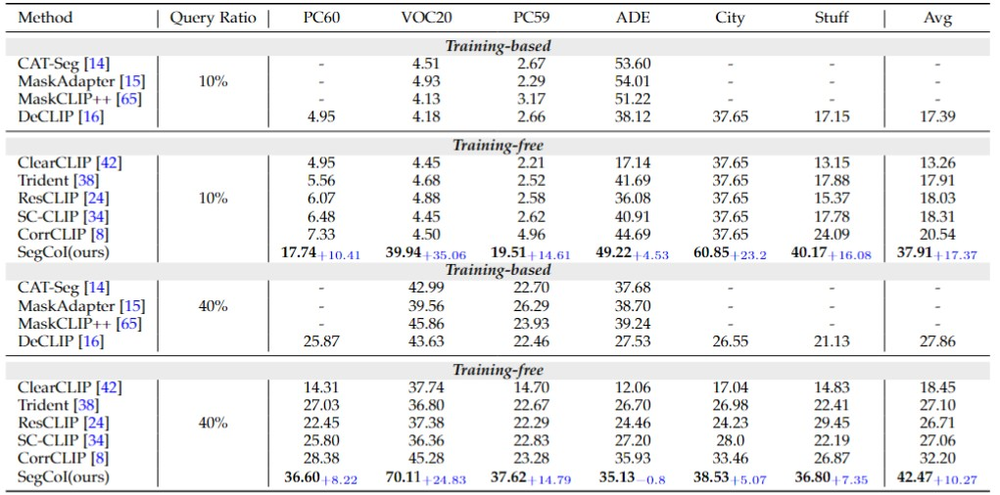
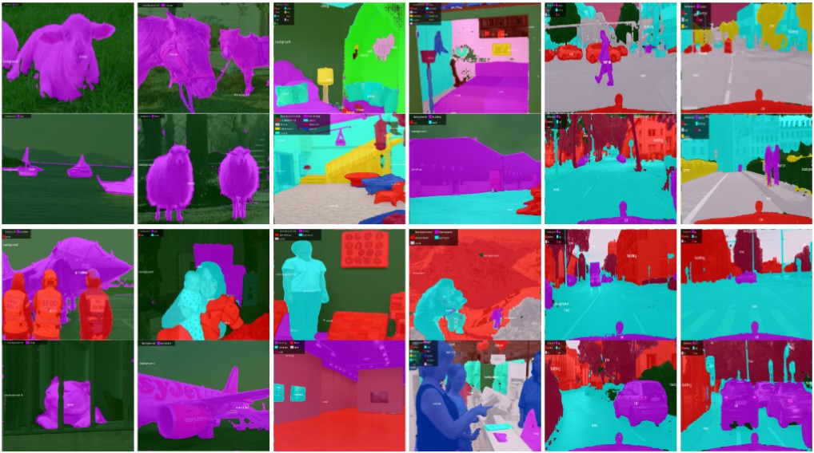
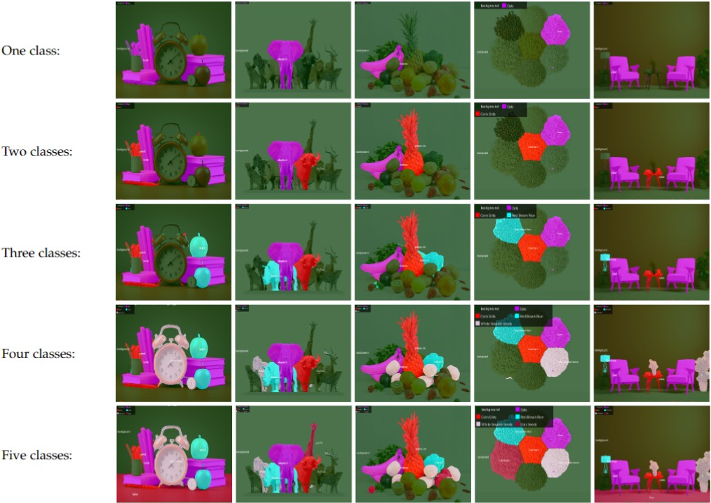
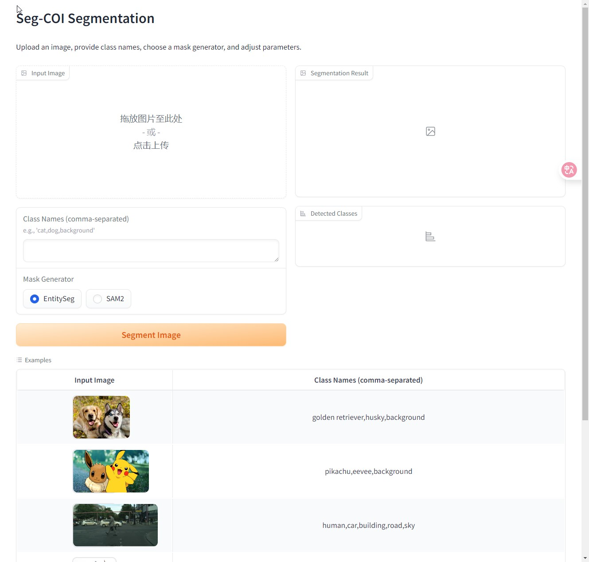

<div align="center">

# Breaking the Boundaries of OVS: A Training-Free Semantic Query Framework for Segmenting Anything with Hypernym

</div>
## 📄 Overview

<div align="center">
   
</div>

> *We propose SegCoI, a novel query-guided, training-free segmentation framework that reinterprets Open-Vocabulary Segmentation (OVS) by focusing on categories of interest. SegCoI introduces a Hierarchical Global-Local Query (HGQ) mechanism, Dominant Category Mask Refinement (DCMR), and a lightweight context-aware attention strategy to refine segmentation boundaries and enhance local visual perception. Extensive experiments show that SegCoI achieves 1.5× performance improvement over existing methods, setting a new state-of-the-art benchmark in interactive visual query segmentation*

## 📦 Dependencies

   ```
   # git clone this repository
   git clone https://github.com/wedsadddq/SegCOI.git
   cd SegCOI
   
   # create new anaconda env
   conda create -n SegCOI python=3.10
   conda activate SegCOI
   
   # install dependencies
   pip install torch==2.1.2 torchvision==0.16.2 torchaudio==2.1.2 --index-url https://download.pytorch.org/whl/cu121
   pip install -U openmim
   mim install mmengine==0.10.7
   mim install mmcv==2.1.0
   pip install mmsegmentation==1.2.2
   pip install -r requirements.txt
   ```

## ⚙️ Mask Generator Configuration

Modify **mask_generator** in [base_config.py](configs/base_config.py) to use different mask generators. To accelerate, you can use the smaller model and adjust the corresponding parameters
in [set_mask_generator](corrclip_segmentor.py).

### SAM2

To replicate the results from our paper, we recommend using the pre-generated SAM2 masks, where relevant parameters can be seen in the paper.

1) Set **mask_generator** to `None`.
2) Download [**_region masks_**](https://huggingface.co/datasets/dk258/CorrCLIP/resolve/main/region_masks.zip?download=true).
3) Extract to the `data/` directory.

If you prefer to generate masks dynamically,

1) Set **mask_generator** to `sam2`.
2) Download [_**sam2_hiera_large**_](https://dl.fbaipublicfiles.com/segment_anything_2/072824/sam2_hiera_large.pt) weights.


## 🚀 Evaluation

### 1. Datasets

`With background class`: PASCAL VOC (VOC21), PASCAL Context (PC60), and COCO Object (Object),

`Without background class`: VOC20, PC59 (i.e., VOC21 and PC60 without the background category), Cityscapes (City), ADE20k (ADE), and COCO Stuff164k (Stuff).

Please follow the data preparation document of [MMSeg](https://github.com/open-mmlab/mmsegmentation/blob/main/docs/en/user_guides/2_dataset_prepare.md) to download and pre-process
the datasets. Move the datasets to the `data/` directory.
The COCO Object dataset can be converted from COCO Stuff164k by executing the following command:

```
python datasets/cvt_coco_object.py PATH_TO_COCO_STUFF164K -o PATH_TO_COCO164K
```

### 2. Running

```
# single-GPU:
python eval.py --config config/cfg_DATASET.py 

# multi-GPU:
bash dist_test.sh config/cfg_DATASET.py NUM_GPU

# evaluation on all datasets:
python eval_all.py
```

### 3. Results


<p align="center">
  
</p>

<p align="center">
  
</p>

<p align="center">
  
</p>


<p align="center">
  
</p>
## 🤖 Gradio Inference

We provide a Gradio demo to perform segmentation on images with custom category names. You can run it on your own machine. 

The demo offers two optional mask generators: SAM2 and EntitySeg. Using them requires their respective model weights and dependencies.

```
python demo_gradio.py
```

<div align="center">

</div>

## ✍️ Citation

```
@article{zhang2024corrclip,
  title={Corrclip: Reconstructing patch correlations in clip for open-vocabulary semantic segmentation},
  author={Zhang, Dengke and Liu, Fagui and Tang, Quan},
  journal={arXiv preprint arXiv:2411.10086},
  year={2024}
}
```

## 🙏 Acknowledgement

Our implementation is based
on [ClearCLIP](https://github.com/mc-lan/ClearCLIP), [ProxyCLIP](https://github.com/mc-lan/ProxyCLIP), [DINO](https://github.com/facebookresearch/dino), [SAM2](https://github.com/facebookresearch/sam2), [Mask2Former](https://github.com/facebookresearch/Mask2Former), [EoMT](https://github.com/tue-mps/EoMT),
and [EntitySeg](https://github.com/qqlu/Entity/blob/main/Entityv2/README.md). Thanks for their awesome work!


